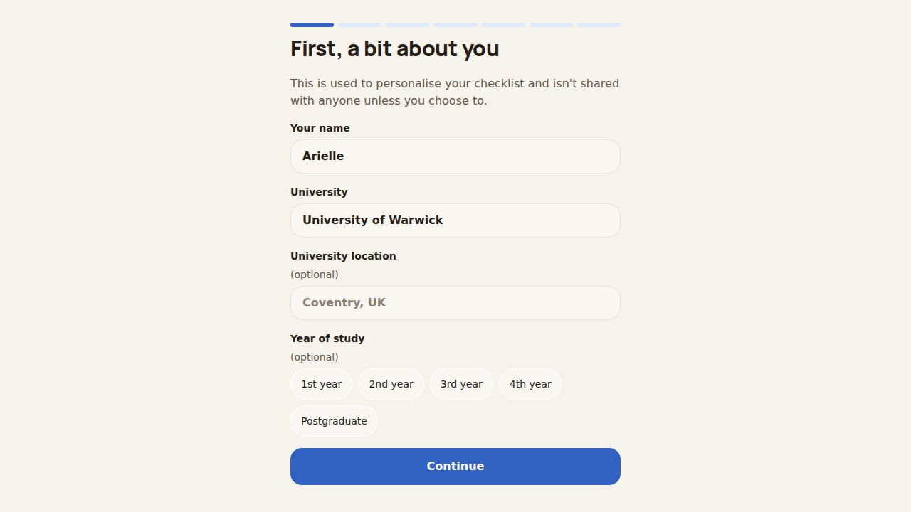
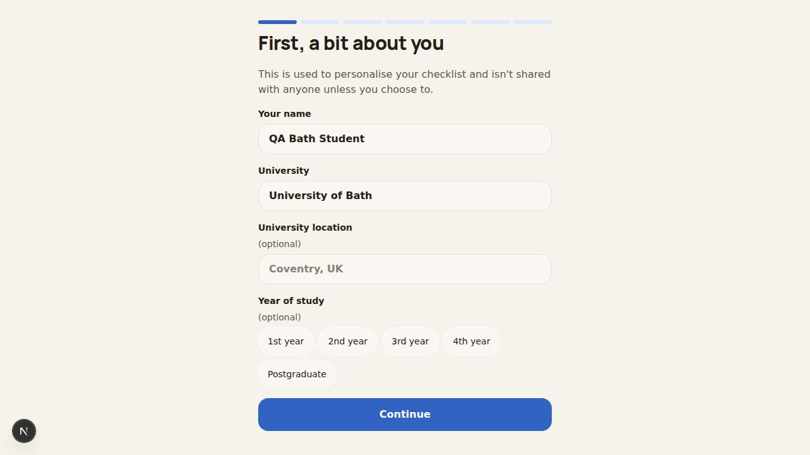
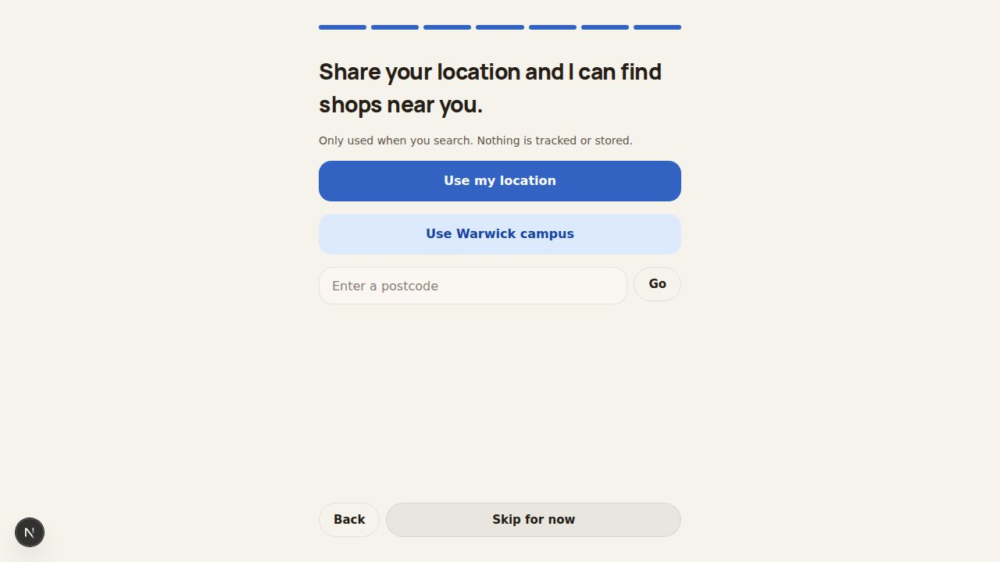
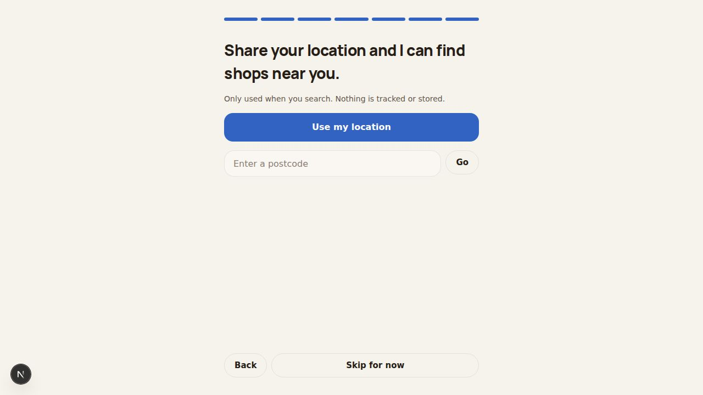
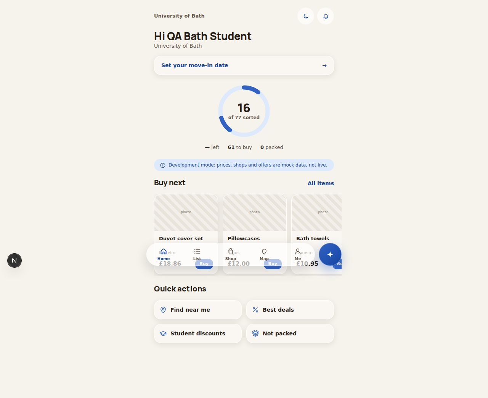
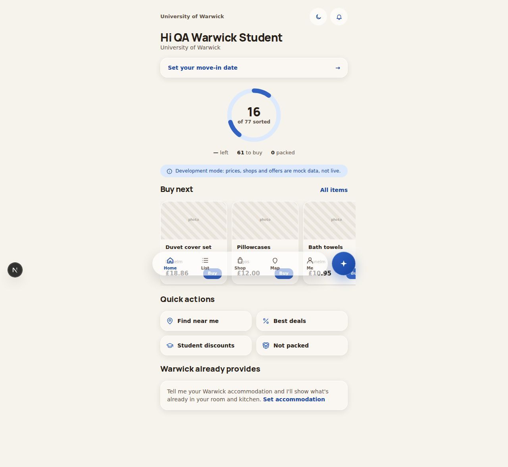

# QA Report: Arielle (Warwick Move-In / unikit.app)

| Field | Value |
|-------|-------|
| **Date** | 2026-09-15 |
| **URL** | http://localhost:3001 (local dev; `LocalStore`/`DeltaStore`, not the production Supabase-backed store) |
| **Branch** | claude/onboarding-university-gdpr-consent |
| **Commit** | e6ac0d2 (2026-09-15) |
| **PR** | — |
| **Tier** | Standard (diff-aware) |
| **Scope** | This branch's diff only: onboarding flow (7 steps), GDPR consent + terms page, Home screen personalization, accommodation-listings API |
| **Duration** | ~45 min |
| **Pages visited** | /onboarding (all 7 steps, ×2 personas), /legal/terms, / (Home, ×2 personas + mobile) |
| **Screenshots** | 11 |
| **Framework** | Next.js 16 (App Router, Turbopack) |

## Health Score: 99/100 (baseline 90/100)

| Category | Score | Coverage |
|----------|-------|----------|
| Console | 100 | full |
| Links | not scored | not tested this pass |
| Visual | 100 | spot-checked (desktop + 390×844 mobile) |
| Functional | 100 (was 70) | full, within scope |
| UX | 100 | full, within scope |
| Performance | not scored | not tested this pass |
| Content | 85 | full, within scope |
| Accessibility | not scored | not tested this pass |

## Top 3 Things to Fix

1. **ISSUE-004: Terms & privacy notice ships with literal `[APP OPERATOR]` / `[CONTACT EMAIL]` placeholders** — live on `/legal/terms`, the page every student is asked to accept before any data is saved. Deferred — needs real business details from the app owner, not something QA can fill in.
2. **ISSUE-001 (fixed): Onboarding offered "Use Warwick campus" to a Bath-typed student.**
3. **ISSUE-002 (fixed): Home showed "Warwick already provides" / "Warwick move-in" to a Bath-typed student.**

## Console Health

No console errors on any page tested (onboarding steps 0–6, `/legal/terms`, Home, ×2 personas, desktop + mobile viewport).

## Summary

| Severity | Count |
|----------|-------|
| Critical | 0 |
| High | 3 |
| Medium | 0 |
| Low | 0 |
| **Total** | **3** |

## Issues

### ISSUE-001: Onboarding's "Use Warwick campus" shortcut shown to non-Warwick students

| Field | Value |
|-------|-------|
| **Severity** | high |
| **Category** | functional |
| **URL** | /onboarding (step 6 of 7, "Share your location") |

**Description:** The final onboarding step unconditionally rendered a "Use Warwick campus" button that sets the student's location to Warwick's real postcode (`CV4 7AL`), regardless of the university typed in step 0. This is the same class of bug the branch's core feature request was meant to prevent — a Bath student, having typed "University of Bath" throughout, was one tap away from silently having their shop-search location set to Warwick.

**Repro Steps:**

1. Onboard as a student who types "University of Bath" in step 0.
   
2. Complete steps 1–5, reach step 6 ("Share your location and I can find shops near you").
3. **Observe:** a "Use Warwick campus" button is present alongside "Use my location" and the postcode field.
   

---

### ISSUE-002: Home screen showed Warwick-specific copy to non-Warwick students

| Field | Value |
|-------|-------|
| **Severity** | high |
| **Category** | content |
| **URL** | / (Home) |

**Description:** Two places on Home ignored the student's actual university: the small header label above "Hi {name}" fell back to the literal string "Warwick move-in" when no accommodation was set, and a "Warwick already provides" card told every student — Bath included — to "Tell me your Warwick accommodation and I'll show what's already in your room and kitchen." That card is driven entirely by `accommodation_profiles`, a Warwick-only hand-verified dataset; showing it to a Bath student is not just mislabeled, it implies room-contents facts the app has no basis for.

**Repro Steps:**

1. Onboard as a student who typed "University of Bath", reach Home.
2. **Observe:** header reads "Warwick move-in"; a "Warwick already provides" section appears with Warwick-specific copy.
   

---

## Fixes Applied

| Issue | Fix Status | Commit | Files Changed |
|-------|-----------|--------|---------------|
| ISSUE-001 | verified | e704ef8 | `src/components/onboarding/onboarding-flow.tsx` |
| ISSUE-002 | verified | 49cee9f | `src/app/(app)/page.tsx` |
| ISSUE-004 | deferred | — | `src/lib/legal/terms.ts` (pre-existing, flagged earlier this session; cannot be fixed without real operator/contact details) |

Both fixes reuse the existing `isWarwickUniversityName()` helper (`src/lib/university-match.ts`), already in the codebase and already exercised by the accommodation-picker step this branch added — same predicate, same normalization, no new matching logic introduced.

### Before/After Evidence

#### ISSUE-001: "Use Warwick campus" hidden for non-Warwick students
**Before:** 
**After:** 

#### ISSUE-002: Home no longer shows Warwick-only copy to non-Warwick students
**Before:** 
**After:** 

#### Regression check: Warwick students unaffected

Re-ran the same profile as "University of Warwick" after both fixes: the "Use Warwick campus" button and "Warwick already provides" card both still render exactly as before. `isWarwickUniversityName` also defaults `true` when a profile has no `university` set at all, so pre-existing Warwick accounts created before this branch's migration are unaffected.

---

## Regression Tests

| Issue | Test File | Status | Description |
|-------|-----------|--------|-------------|
| ISSUE-001 / ISSUE-002 | `tests/unit/university-match.test.ts` | committed | `isWarwickUniversityName` — matches Warwick spellings a student would type, rejects other universities including the "University of Warwickshire" near-miss substring, rejects blank input |

Full suite re-run after the fixes and the new test: **124 passed, 8 skipped, 0 failed** (`pnpm test`). `pnpm typecheck` and `pnpm lint` both clean.

### Deferred Tests

None — both fixes are covered by the committed regression test above at the predicate level (`isWarwickUniversityName`), which is what both fixes actually branch on. A full component-render test for `onboarding-flow.tsx` / `page.tsx` would need a testing-library setup this codebase doesn't currently have (`tests/unit/*` are all pure-logic tests, no React component tests exist to pattern-match against) — flagging as a possible future addition, not blocking this fix.

---

## Ship Readiness

| Metric | Value |
|--------|-------|
| Health score | 90 → 99 (+9) |
| Issues found | 3 (2 fixable, 1 deferred) |
| Fixes applied | 2 (verified: 2, best-effort: 0, reverted: 0) |
| Deferred | 1 (ISSUE-004, needs real business info from the app owner) |

**PR Summary:** "QA found 3 issues on the onboarding/GDPR-consent/accommodation branch, fixed 2 (Warwick-only UI leaking to non-Warwick students), deferred 1 (terms page placeholders need real operator/contact info), health score 90 → 99."

---

## Known Testing Gap (not a defect)

This dev server runs on `LocalStore`/`DeltaStore` (`env.dataMode === "local"`), which by design always returns `[]` from `listAccommodationListings()` — there's no local/demo copy of the scraped `accommodation_listings` Supabase data. This means the "does a Bath/Exeter student actually see their 43/63 real scraped listings" path could **not** be exercised through the browser in this pass. What *was* verified:

- The "no verified data yet" fallback UI (shown for every university in local mode) renders correctly and is non-blocking — screenshot: `screenshots/issue-003-accommodation-nodata-bath.jpg`.
- The query path itself (`findUkprnForUniversity` → `accommodation_listings` keyed by `university_ukprn`) was verified directly against the live Supabase project via SQL: Bath (ukprn 10007850) returns 43 rows, Exeter (ukprn 10007792) returns 63 rows, both correctly keyed and addressable by the exact name-normalization the onboarding flow captures.

Recommend a follow-up QA pass against a preview deployment wired to the real Supabase project (or with `env.dataMode` pointed at Supabase locally) to close this gap end-to-end.

## Also Noticed, Out of Scope (flagged, not fixed)

Per Repo Ownership rules, flagging rather than fixing — these are pre-existing, not touched by this branch, and fixing them properly is a separate, larger scope decision:

- `WARWICK_CAMPUS` is used as a silent default location fallback in several pre-existing files not touched by this branch (`src/lib/ai/tools.ts`, `src/lib/ai/fallback.ts`, `src/lib/services/compare.ts`, `src/app/api/basket/optimise/route.ts`, `src/app/api/agent/route.ts`, `src/components/map/location-picker.tsx`). A non-Warwick student with no location set will still get Warwick-centered shop search/price comparison behavior in those flows. Properly fixing this needs per-university shop-location data, comparable in scope to the accommodation-listings pipeline this session already built — not a QA-loop-sized fix.
- The underlying shopping checklist content itself (`data/warwick_move_in_checklist.csv`) appears Warwick-specific regardless of the student's university — items shown on Home's "Buy next" (Duvet cover set, Pillowcases, Bath towels) are the same generic/Warwick list for every persona. Same scope note as above.
